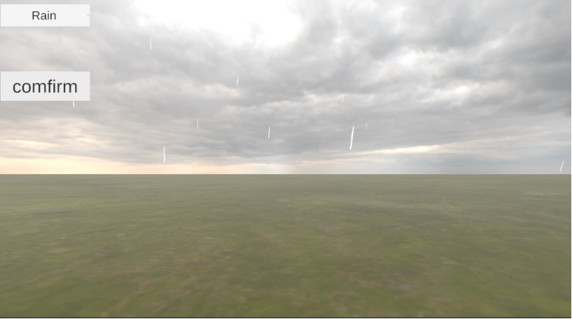
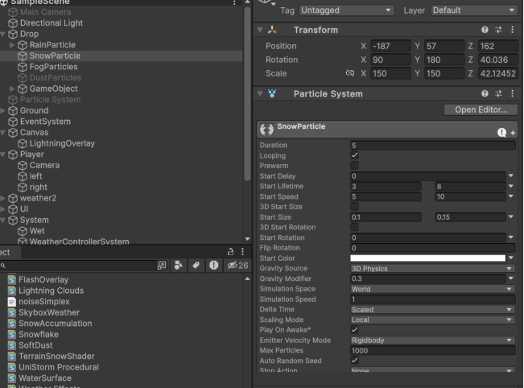
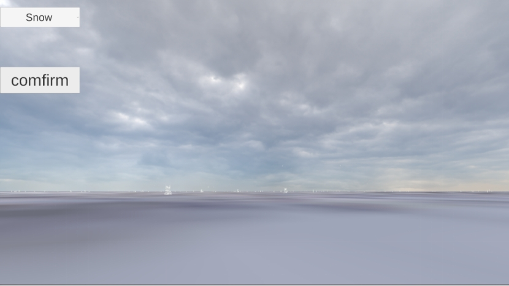
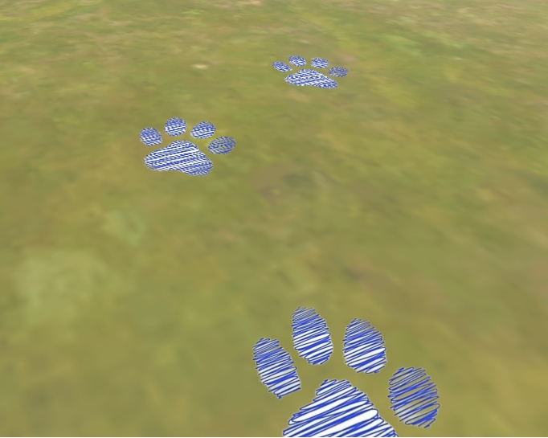

### 作品概述

#### 应用领域：

本作品以“动态天气系统着色效果” 为主题，聚焦数字媒体与互动娱乐领域，依托Unity引擎构建具备多元天气变化与实时环境反馈的三维场景。系统可根据晴天、雨天、雪天、雷暴等不同天气类型，动态调节场景光照强度、地表湿润度、积雪覆盖厚度、天空盒视觉效果及特殊环境特效，以此增强虚拟世界的沉浸体验。雨天时地表材质会随时间推移呈现湿润反光效果；雪天则通过地形着色器实时计算积雪堆积程度，改变玩家行走的脚印形态与场景物理逻辑；雷暴天气中，闪电特效与环境光照深度联动，还会触发引雷交互机制，强化玩家对环境的动态感知。

#### 核心功能：

实时天气切换、地表湿润与积雪效果、角色脚印与环境交互、雷暴与闪电特效、天空极光渲染等。玩家在场景中移动时，系统会根据当前天气自动渲染相应的地表与天空效果，并生成与环境相符的脚印、雨雪痕迹等，极大提升了视觉表现力和交互体验。

### 系统架构

#### 技术栈：

编程语言：C#，作为游戏逻辑开发的核心语言，其强大的面向对象编程特性与丰富的类库，为游戏功能实现提供有力支持。

框架/库：Unity 2023（实际版本），是游戏开发的核心引擎，提供了完整的开发工具链，包括场景搭建、角色建模、动画制作、物理模拟等功能。

.NET Framework 4.7.1，为C#代码运行提供基础环境与类库支持，确保游戏逻辑的稳定执行。

硬件依赖：Windows PC，需具备标准键鼠输入设备，以满足玩家的操作需求。

部署方式：通过Unity引擎将项目打包为PC端可执行程序（.exe），方便玩家直接下载安装并运行。

#### 系统流程:

玩家启动游戏后，系统初始化当前天气状态，并根据天气类型加载相应的着色器和环境参数。主控制器（如WeatherController、SystemController）负责监听天气变化事件，动态切换地表、天空、光照等效果。角色控制器（PlayerController）与脚印管理器（FootprintPainter）协同工作，实现角色与地表的交互反馈，如在雪地生成脚印、在雨天生成湿润痕迹。特殊天气（如雷暴）由专用控制器（ThunderstormController）触发闪电、雷声等特效。所有视觉效果通过自定义Shader（如Weather.shader、SnowAccumulation.shader、AuroraSky.shader等）实时渲染，确保画面表现的连贯与真实。

### 功能模块实现与演示

本系统主要包括天气控制、地表渲染、角色交互、特效管理四大子模块。各模块既相互独立又通过事件驱动和数据同步机制协同工作，确保了系统的高效性与可维护性。

1、天气控制模块
天气控制模块以WeatherController为核心，负责管理和切换不同的天气状态（如晴天、雨天、雪天、雷暴等）。该模块通过玩家触发的方式切换天气类型，并将当前天气参数广播给其他相关模块。具体实现中，WeatherController会根据设定的天气类型，动态调整全局光照、天空盒、粒子系统（如雨滴、雪花）等参数，并通过事件机制（如C#事件或UnityEvent）通知地表渲染、特效管理等模块进行相应的视觉和物理效果切换。演示时，玩家可通过UI或快捷键切换天气，场景中的环境效果会实时变化，体现系统的动态响应能力。

 

同时，通过不同的粒子系统，我们可以实现雨雪等多种天气的模拟，更加真实、细致。

 

2、地表渲染模块
对于地表，我们首先要进行地表的搭建。选用合适的材质进行搭建，可以使用Terrian、外部模型或者自己创建的gameobject加贴图来进行地面搭建。搭建完地面后，面对天空，我采用了天空盒的方式来实现天气的转变，从晴天到雨到阴天，使过渡更自然，更平滑。

地表渲染模块主要由WetSurfaceManager、SnowSurfaceManager等脚本和自定义Shader（如Weather.shader、SnowAccumulation.shader）组成。该模块根据天气控制模块广播的天气类型，动态调整地表材质的属性，实现如地面湿润、积雪覆盖、尘土飞扬等效果。例如，雨天时WetSurfaceManager会提升地表反射率和湿度参数，雪天时SnowSurfaceManager会增加积雪厚度并调用TerrainSnowShader渲染雪层。所有地表效果均通过Shader实时渲染，保证画面表现的自然与流畅。演示时，随着天气变化，地表材质和视觉效果会同步切换，增强沉浸感。

 

3、角色交互模块
角色交互模块以PlayerController、FootprintPainter等脚本为核心，负责角色与环境的动态交互。FootprintPainter根据角色步伐和地表类型，实时生成左右脚印，并自动适应地表法线方向，确保脚印与地形贴合。雨天或雪天时，脚印会呈现出湿痕或积雪压痕的特殊效果，进一步提升真实感。

 

4、特效管理模块
特效管理模块主要负责特殊天气下的视觉与音效表现，如雷暴、极光等。以ThunderstormController为例，该脚本在雷暴天气下定时触发闪电、雷声等特效，并通过FlashOverlay.shader等实现闪电照明和屏幕闪烁效果。极光等特殊天气则通过AuroraSky.shader渲染动态天空极光，营造独特的视觉氛围。所有特效均与天气控制模块联动，确保在天气切换时自动启用或关闭相应效果。演示时，切换到雷暴或极光天气，场景中会出现对应的视觉和音效特效，极大丰富了游戏体验。

 

各模块通过事件驱动（如C#事件、委托）和数据同步（如单例管理器、全局参数）机制实现高效协作。例如，天气切换时，WeatherController会广播事件，地表渲染、特效管理等模块监听并响应，实现系统的动态联动和高效运行。

#### 演示视频如下：

https://www.bilibili.com/video/BV1zHGEzPE6G/?spm_id_from=333.1387.list.card_archive.click&vd_source=46eaf9cba2c61837af1019a3e50afe1a

#### GitHub地址：

https://github.com/Sufrost/Dynamic_Weather_System.git
